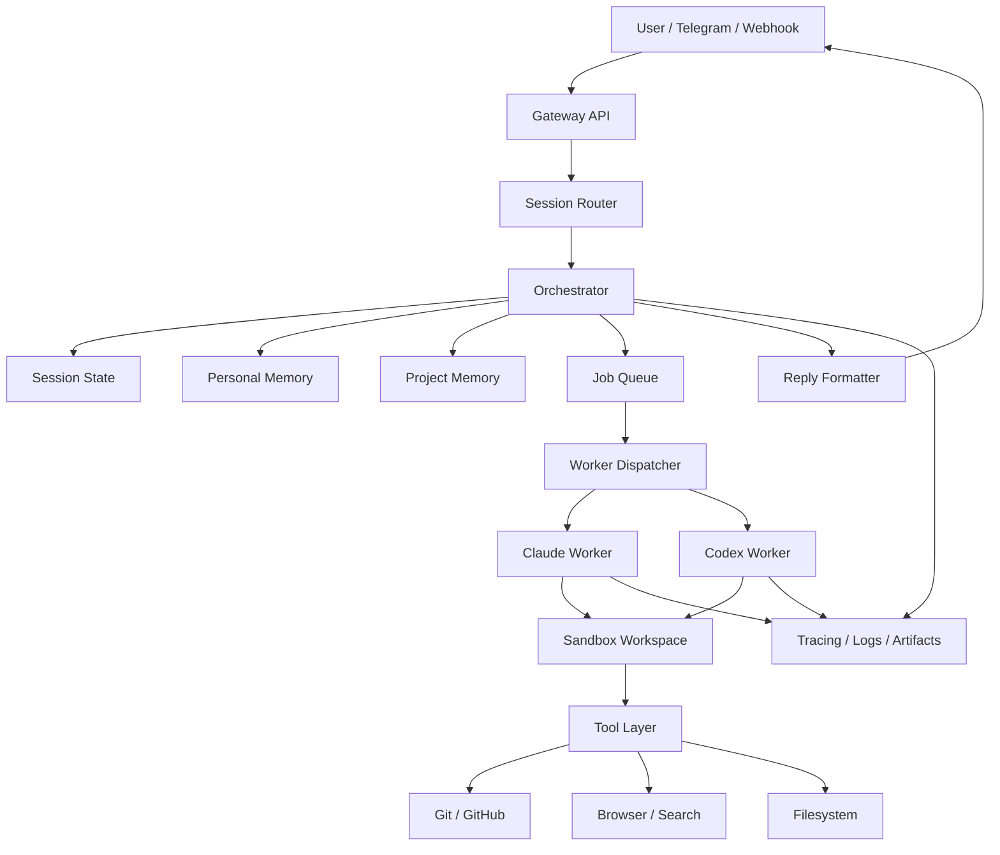

# Architecture

## Overview

This service is a personal coding-agent platform.

It receives tasks from messages or webhooks, restores session context, loads memory,
routes the task to a coding worker, executes inside an isolated workspace, then returns
progress and final results.

The system separates:
- control plane
- execution plane
- memory plane

## High-level diagram

## Services

### 1. Gateway API

Responsibilities:

- HTTP webhook ingress
- Telegram webhook ingress
- auth / allowlist checks
- session lookup / creation
- reply delivery
- health endpoints

Does not own:

- task routing logic
- memory selection logic
- repo execution

### 2. Orchestrator

Responsibilities:

- task classification
- memory load/save
- worker routing
- approval checkpoints
- retries
- state persistence
- result summarization

Recommended implementation:

- LangGraph-backed workflow
- explicit node/state model

### 3. Worker layer

Responsibilities:

- convert generic task into provider-specific worker execution
- manage coding-task loop
- return structured results

Workers:

- ClaudeWorker
- CodexWorker

All workers implement the same interface.

### 4. Sandbox

Responsibilities:

- create isolated workspace
- clone repo or create worktree
- run commands in container
- capture artifacts/logs/diffs
- expose safe paths to worker

### 5. Memory layer

Responsibilities:

- persist and retrieve structured memory
- keep memory inspectable
- support memory deletion/editing
- load relevant memory by repo/session/user

Memory buckets:

- personal
- project
- session/thread

### 6. Tool layer

Responsibilities:

- wrap integrations behind stable interfaces
- prepare for MCP compatibility
- isolate external side effects

## State model

### Session

Represents an ongoing conversation/thread.

Fields:

- session_id
- user_id
- channel
- external_thread_id
- active_task_id
- status
- last_seen_at

### Task

Represents one requested unit of work.

Fields:

- task_id
- session_id
- repo_url
- branch
- task_text
- status
- priority
- chosen_worker
- route_reason
- created_at
- updated_at

### Worker run

Represents one coding-worker execution attempt.

Fields:

- run_id
- task_id
- worker_type
- workspace_id
- started_at
- finished_at
- status
- summary
- commands_run
- files_changed_count
- artifact_index

## Orchestrator flow

1. Ingest task
2. Normalize input
3. Classify task
4. Load personal/project/session memory
5. Choose worker
6. Dispatch worker job
7. Wait for result
8. Summarize result
9. Persist useful memory
10. Send reply

## Routing policy

### Route to ClaudeWorker when

- task is high-stakes
- task is ambiguous
- multi-file refactor
- architectural reasoning needed
- prior cheaper worker failed

### Route to CodexWorker when

- task is straightforward
- cheaper daily implementation is preferred
- repetitive edits
- lower-risk coding loop

Manual override should always exist.

## Security boundaries

### Trusted zone

- gateway service
- orchestrator service
- DB
- artifact store

### Less-trusted execution zone

- per-task sandbox container
- worker process
- repo workspace

Rules:

- worker never runs directly on host for task execution
- secrets are injected minimally
- destructive actions require approval
- auth/billing/sandbox code paths are protected

## Failure handling

### Worker failure

- record run failure
- preserve logs/artifacts
- retry only if policy allows
- optionally reroute to alternate worker

### Sandbox failure

- mark workspace failed
- keep logs
- do not auto-retry infinite loops

### Orchestrator restart

- restore graph state/checkpoint
- resume waiting tasks safely

## Observability

Track:

- task duration
- worker choice
- route reason
- retry count
- success/failure status
- sandbox command history
- changed files count
- approval interruptions

## V1 choices

Use:

- FastAPI
- LangGraph
- Postgres
- Docker sandbox
- Claude + Codex worker adapters
- simple structured memory tables

Do not add in v1:

- complex graph memory infra
- multi-user billing
- autonomous self-modifying code
- broad device/chat integrations
