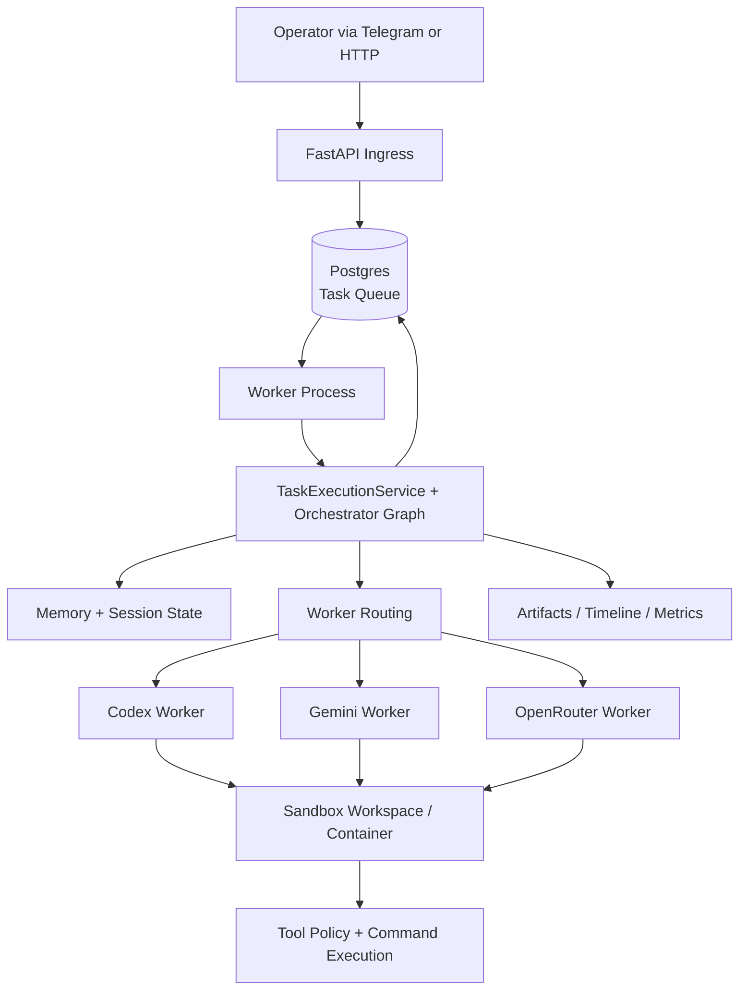

# Architecture

## Product Model

`code-agent` is a local-first coding agent platform with a strict separation between:

- session/control concerns (platform)
- repo execution concerns (workers + sandbox)
- durable context concerns (memory + persistence)

Core principle: use the platform for cross-run control, and worker runtimes for session-local cognition.

## Layered Architecture

## 1) Platform / Control Plane

Owns request intake, durable state, and run lifecycle governance.

Responsibilities:

- ingress and auth for API/webhook/Telegram
- session + task creation and persistence
- queueing and lease-based claiming
- orchestration graph execution
- worker routing policy and manual override handling
- approval checkpoints and operator decisions
- replay/retry lifecycle control
- timeline/metrics emission

Primary modules:

- `apps/api/`
- `apps/runtime.py`
- `orchestrator/`
- `repositories/`
- `db/`

## 2) Worker Runtime Layer

Owns provider-specific coding execution behind a shared contract.

Responsibilities:

- adapt generic worker requests into provider-specific runtime calls
- run bounded coding loops with explicit tool boundaries
- emit structured outputs (`status`, `summary`, `commands_run`, `files_changed`, artifacts)
- perform worker-local self-review/fix loops where configured

Active worker/runtime implementations:

- Codex CLI worker (`workers/codex_cli_worker.py`)
- Gemini CLI worker (`workers/gemini_cli_worker.py`)
- OpenRouter-backed runtime worker (`workers/openrouter_cli_worker.py`)

- `workers/base.py`

### Worker Routing Policy (Current)

Until the full profile-based strategy (Milestone 16) is implemented, the platform uses a simplified routing heuristic:

- **Codex Worker**: Default for straightforward coding tasks, documentation updates, and small-scale refactors.
- **Gemini Worker**: Used for complex tasks requiring high-level reasoning, architectural changes, or multi-step cognitive loops.
- **OpenRouter Worker**: Used for model evaluation and as a fallback for specific model capabilities not covered by the primary workers.

The routing decision is currently made by the orchestrator based on task complexity hints or manual operator overrides.

## 3) Sandbox + Tool Layer

Owns safe execution of repository mutations and command/tool effects.

Responsibilities:

- provision isolated workspaces and persistent sandbox containers
- execute shell commands through policy gates
- enforce path and permission policies
- redact sensitive data in captured outputs
- capture command/test/diff artifacts and retention metadata

Primary modules:

- `sandbox/`
- `tools/`

## 4) Memory Layer

Owns durable context that survives individual runs.

Responsibilities:

- persist skeptical memory entries with provenance + confidence metadata
- maintain compact session state across turns
- load relevant hints during orchestration
- keep memory inspectable/editable/deletable via API/admin paths

Memory categories in v1:

- personal memory
- project memory
- session/thread state

Primary modules:

- `memory/`
- memory-related repositories in `repositories/`
- schema in `db/models.py` + migrations

## 5) Operator Surfaces

Owns human-facing control and visibility interfaces.

Current operator surfaces:

- task submission/status/replay/approval endpoints (`/tasks`)
- webhook + Telegram ingress routes
- progress notifications (`started`, `running`, terminal)
- health/readiness + operational metrics endpoints

Future operator surface direction is a local dashboard/PWA for richer inspection and controls.

## 6) Future Reflection / Autonomy Layer

Planned, not yet a full implemented subsystem.

Intended responsibilities:

- bounded scout mode for proactive idea generation
- structured friction and improvement proposal pipelines
- operator-curated review queues for suggested changes
- explicit maintenance-action requests (not privileged self-mutation)

This lane remains controlled, inspectable, and human-in-the-loop for high-risk operations.

## Runtime Topology (Today)

## Queue + Lease Model

- API writes tasks as pending records.
- Worker process polls queue (`CODE_AGENT_QUEUE_POLL_INTERVAL_SECONDS`, default `2`).
- Worker atomically claims tasks with lease ownership and expiry (`CODE_AGENT_QUEUE_LEASE_SECONDS`, default `60`).
- Heartbeats extend lease while the run is active.
- On success/failure, lease is cleared and status transitions persist.
- Failed attempts are retried up to configured max attempts before terminal failure.

## Safety Boundaries

Hard boundaries currently enforced:

- sandboxed repo execution through dedicated workspace/container flow
- task ingress protected by shared-secret auth
- explicit approval checkpoint flow for tasks requiring manual approval
- callback SSRF protections for outbound progress webhooks
- secret-redaction and command artifact capture for inspection/audit
- budget and tool permission gates in orchestration/worker runtime paths

## Source Of Truth For Behavior

For day-to-day operation and troubleshooting, pair this document with:

- runbook: `docs/runbook.md`
- current operational status: `docs/status.md`
