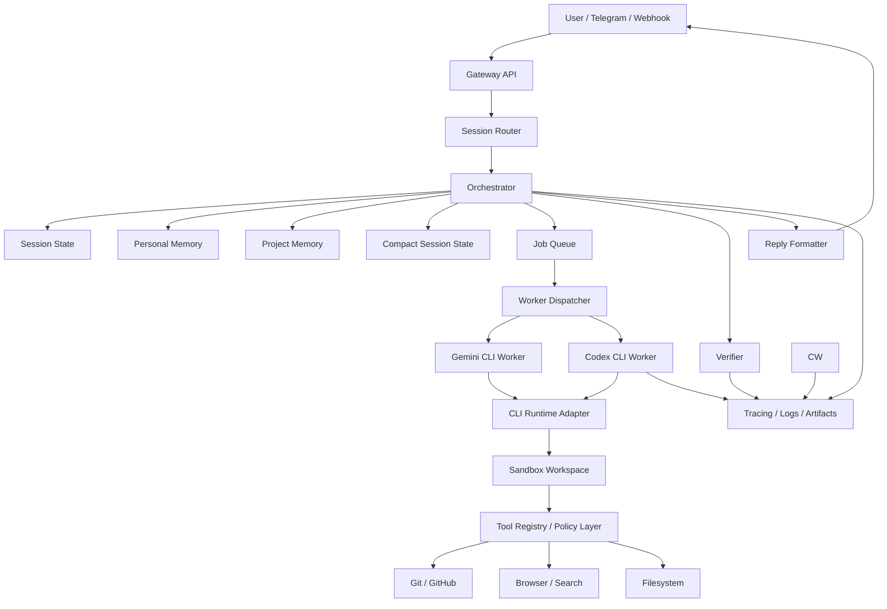

# Architecture

## Overview

This service is a personal coding-agent platform.

It receives tasks from messages or webhooks, restores session context, loads memory,
routes the task to a coding worker, executes inside an isolated workspace, then returns
progress and final results.

The system separates:
- control plane
- execution plane
- memory plane

## High-level diagram

## Services

### 1. Gateway API

Responsibilities:

- HTTP webhook ingress
- Telegram webhook ingress
- auth / allowlist checks
- session lookup / creation
- reply delivery
- health endpoints

Does not own:

- task routing logic
- memory selection logic
- repo execution

### 2. Orchestrator

Responsibilities:

- task classification
- skeptical memory load/save
- worker routing
- approval checkpoints
- budget enforcement
- retries
- state persistence
- verifier orchestration
- result summarization

Recommended implementation:

- LangGraph-backed workflow
- explicit node/state model

### 3. Worker layer

Responsibilities:

- convert generic task into provider-specific worker execution
- adapt CLI/SDK/hook/subprocess runtimes behind the shared worker contract
- manage coding-task loop
- request tool execution through a policy-aware tool boundary
- report usage/accounting when the runtime exposes it
- return structured results

Workers:

- Gemini CLI worker
- Codex CLI worker

All workers implement the same interface.

### 4. Sandbox

Responsibilities:

- create isolated workspace
- clone repo or create worktree
- run commands in container
- capture artifacts/logs/diffs
- expose safe paths to worker

### 5. Memory layer

Responsibilities:

- persist and retrieve structured memory
- keep memory inspectable
- support memory deletion/editing
- load relevant memory by repo/session/user
- treat stored memory as hints that may require verification before action
- compact long-running sessions into concise working state

Memory buckets:

- personal
- project
- session/thread working state

### 6. Tool layer

Responsibilities:

- wrap integrations behind stable interfaces
- declare explicit tool metadata and permission requirements
- prepare for MCP (Model Context Protocol) compatibility
- isolate external side effects

Each tool should declare:

- capability category
- side-effect level
- required permission
- timeout
- network requirement
- expected artifacts
- deterministic vs non-deterministic behavior

## CLI-driven runtime boundary

The current execution plan is CLI-first rather than raw-API-first.

What the system should control directly:

- worker selection
- stable session scaffold construction
- tool registry and permission policy
- sandbox lifecycle
- compact memory header
- budget ledger
- artifact capture
- verifier inputs/outputs

What may be owned by the CLI runtime and must be treated as optional:

- provider-specific session identifiers
- prompt/session caching behavior
- usage token accounting
- streaming event detail
- hook injection points

If a CLI exposes resumable session handles or usage events, persist them. If it does not, regenerate
the same stable scaffold deterministically and continue without assuming hidden cache features.

## State model

### Session

Represents an ongoing conversation/thread.

Fields:

- session_id
- user_id
- channel
- external_thread_id
- active_task_id
- status
- last_seen_at

### Task

Represents one requested unit of work.

Fields:

- task_id
- session_id
- repo_url
- branch
- task_text
- status
- priority
- chosen_worker
- route_reason
- created_at
- updated_at

### Worker run

Represents one coding-worker execution attempt.

Fields:

- run_id
- task_id
- worker_type
- workspace_id
- started_at
- finished_at
- status
- summary
- commands_run
- files_changed_count
- artifact_index
- stop_reason
- usage/accounting
- verifier_result

## Orchestrator flow

1. Ingest task
2. Normalize input
3. Classify task
4. Load personal/project/session memory and compact working state
5. Choose worker/runtime
6. Dispatch worker job
7. Wait for result or permission escalation
8. Verify result
9. Summarize result
10. Persist useful memory and updated compact state
11. Send reply

## Routing policy

### Route to Gemini-family worker when

- task is high-stakes
- task is ambiguous
- multi-file refactor
- architectural reasoning needed
- prior cheaper worker failed
- prior verifier result suggests the cheaper worker under-scoped the task

### Route to Codex-family worker when

- task is straightforward
- cheaper daily implementation is preferred
- repetitive edits
- lower-risk coding loop
- runtime availability and budget preference favor the cheaper path

Manual override should always exist.

## Security boundaries

### Trusted zone

- gateway service
- orchestrator service
- DB
- artifact store

### Less-trusted execution zone

- per-task sandbox container
- worker process
- repo workspace

Rules:

- worker never runs directly on host for task execution
- secrets are injected minimally
- destructive actions require approval
- permission enforcement must happen at the tool/command boundary, not only from task-text heuristics
- auth/billing/sandbox code paths are protected

## Failure handling

### Worker failure

- record run failure
- preserve logs/artifacts
- retry only if policy allows
- optionally reroute to alternate worker

### Sandbox failure

- mark workspace failed
- keep logs
- do not auto-retry infinite loops

### Orchestrator restart

- restore graph state/checkpoint
- resume waiting tasks safely

## Observability

Track:

- task duration
- worker choice
- route reason
- retry count
- success/failure status
- sandbox command history
- changed files count
- approval interruptions
- permission escalations
- budget consumption
- verifier outcome

## V1 choices

Use:

- FastAPI
- LangGraph
- Postgres
- Docker sandbox
- CLI-first Gemini + Codex worker adapters over the shared worker interface
- simple structured memory tables with verification metadata and compact session state

Do not add in v1:

- complex graph memory infra
- multi-user billing
- autonomous self-modifying code
- broad device/chat integrations
