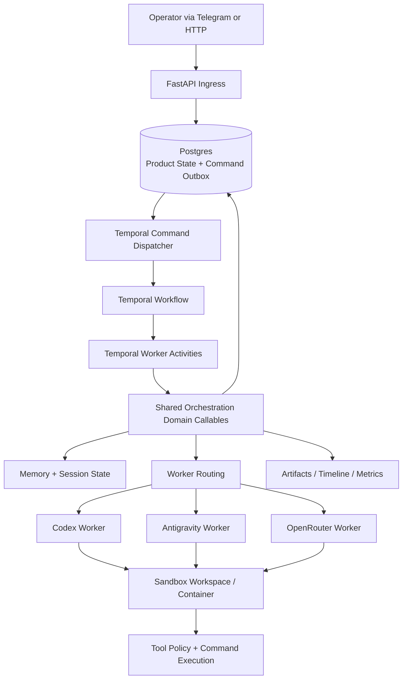
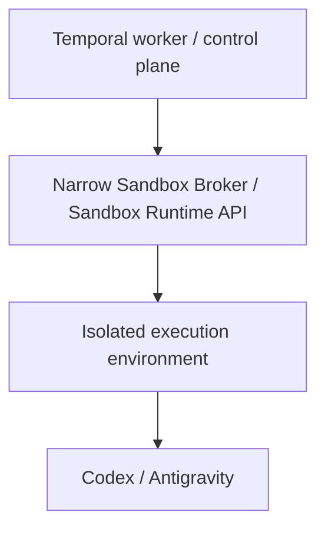

# Architecture

This document distinguishes **Current** implementation, **Planned** milestone
work, **Target architecture** direction, and **Future / conditional** options.
Target and future sections do not claim that the described boundaries exist on
the current branch.

## Product Model

`code-agent` is a local-first coding agent platform with a strict separation between:

- session/control concerns (platform)
- repo execution concerns (workers + sandbox)
- durable context concerns (memory + persistence)

Core principle: use the platform for cross-run control, and worker runtimes for session-local cognition.

The product is not restarting. Its direction remains a local-first personal
coding agent with native provider cognition, Temporal durability, strong
sandboxing and permissions, deterministic verification, independent review,
inspectable evidence, skeptical memory, human control for risky operations,
and reviewable branch or draft-PR delivery.

## Target Architectural Principles

1. **Providers own cognition.** Codex, Antigravity, and future native coding
   agents own the session-local coding/reasoning loop. `code-agent` adapts and
   governs them instead of recreating provider-local cognition.
2. **Temporal owns durable coordination.** Workflow lifecycle, retries, waits,
   cancellation, durable child work, scheduling, and long-running coordination
   belong in Temporal.
3. **The sandbox owns effects.** Native or otherwise untrusted agents must not
   directly control privileged infrastructure or unrelated host resources.
4. **Policy owns capabilities.** Effective read, write, shell, network, Git,
   GitHub, and secret access is generated and enforced deterministically. A
   prompt can explain a grant; it is not the enforcement boundary.
5. **Postgres owns product projections and durable knowledge.** Postgres stores
   queryable product views, memory, evaluations, artifact metadata, external
   identities, search/reporting data, and external-side-effect idempotency. It
   should not grow into a second full workflow state machine beside Temporal.
6. **Evidence determines success.** Provider exit codes and self-reported
   completion are execution evidence, not task acceptance. Agent execution,
   acceptance, verification, review, and delivery are separate outcomes.
7. **Orchestration complexity must earn its place.** Default to one strong
   native coding agent plus verification, independent review, and bounded
   repair. Decompose or fan out only when independent context, parallel
   research, large context, or subsystem separation provides measured benefit.
8. **Reasoning and mechanics stay separate.** Use provider/LLM reasoning for
   the coding decisions that require it; use deterministic platform code for
   known operations such as Git status/diff inspection, validation rules,
   tests and linters, artifact collection, acceptance-evidence extraction,
   merge/reconciliation where possible, and permission/capability enforcement.

### Thin Orchestration Kernel Target

The current system has accumulated orchestration glue across workflows, graph
nodes, activities, execution services, routing, memory, verification, repair,
and delivery. This is not a proposal for an immediate refactor.

The target is a small, deterministic durable core with conceptually separate
responsibilities such as `TaskWorkflow`, `PlanPolicy`, `CapabilityPolicy`,
`ContextAssembler`, `RuntimeRouter`, `AcceptanceEvaluator`, verification/review
coordination, and `DeliveryController`. These are responsibility boundaries,
not required class names or an M28.5 module-renaming task. Native providers
continue to own session-local coding cognition. New contracts such as
`AgentEvent` and `ContextEnvelope` should sharpen these boundaries rather than
add more responsibilities to existing orchestration hotspots.

## Current Layered Architecture

## 1) Platform / Control Plane

Owns request intake, durable state, and run lifecycle governance.

Responsibilities:

- ingress and auth for API/webhook/Telegram
- session + task creation and persistence
- generated TaskSpec contract for task goal/risk/type/delivery policy
- model-backed orchestrator brain with deterministic TaskSpec and routing fallbacks
- transactional Temporal command outbox and workflow startup
- Temporal workflow lifecycle execution
- worker routing policy and manual override handling
- approval checkpoints and operator decisions
- replay/retry lifecycle control
- timeline/metrics emission

Primary modules:

- `apps/api/`
- `apps/runtime.py`
- `orchestrator/`
- `repositories/`
- `db/`

## 2) Worker Runtime Layer

Owns provider-specific coding execution behind a shared contract.

Responsibilities:

- adapt generic worker requests into provider-specific runtime calls
- run bounded coding loops with explicit tool boundaries
- emit structured outputs (`status`, `summary`, `commands_run`, `files_changed`, artifacts)
- perform worker-local self-review/fix loops where configured

Active worker/runtime implementations:

- Codex CLI worker (`workers/codex_cli_worker.py`)
- Antigravity CLI worker
- OpenRouter-backed runtime worker (`workers/openrouter_cli_worker.py`)

All implementations conform to the shared contract in `workers/base.py`.

### Worker Routing Policy (Current)

Before routing, the orchestrator builds and persists a TaskSpec so workers, APIs, and operator views share an inspectable task contract. Routing resolves through a capability matrix and pins dispatch to one concrete `WorkerProfile` (`worker_type`, `runtime_mode`, capability tags, permission/mutation policy, and delivery-mode support).

Profile mapping:
- Codex/Antigravity default runtime mode is pinned to `native_agent`.
- `CODE_AGENT_CODEX_RUNTIME_MODE`, `CODE_AGENT_GEMINI_RUNTIME_MODE`, `CODE_AGENT_CODEX_TOOL_LOOP_LEGACY_ENABLED`, and `CODE_AGENT_GEMINI_TOOL_LOOP_LEGACY_ENABLED` are deprecated and ignored; Codex and Antigravity are now native-only and legacy tool-loop profiles are no longer created.
- OpenRouter legacy execution profile is added only when OpenRouter is configured and `CODE_AGENT_OPENROUTER_ENABLED=1`.
- Execution routing then filters profiles by worker availability, execution capability tag, read-only vs patch-allowed mutation policy, and delivery-mode compatibility before selecting a concrete profile.

Current default profile matrix:

- **Codex execution**: `codex-native-executor` with explicit read-only variant `codex-native-executor-read-only`
- **Antigravity execution**: `antigravity-native-executor` with explicit read-only variant `antigravity-native-executor-read-only`
- **Antigravity specialist profiles** (native mode): `antigravity-native-planner`, `antigravity-native-reviewer`, and `antigravity-native-discovery`
- **OpenRouter legacy execution**: `openrouter-tool-loop-legacy` (explicit opt-in only)

The selected worker/profile/runtime metadata is persisted on task and worker-run records and returned in task snapshots for operator and dashboard inspection.

The performance-routing mechanism currently reads checked-in advisory metrics
from `evaluation/routing_metrics.json`. Those values are not refreshed from
live task outcomes. M25.6 measures real Temporal runs before any routing-policy
change is considered.

## 3) Sandbox + Tool Layer

Owns safe execution of repository mutations and command/tool effects.

Responsibilities:

- provision isolated workspaces and persistent sandbox containers
- execute shell commands through policy gates
- enforce path and permission policies
- redact sensitive data in captured outputs
- capture command/test/diff artifacts and retention metadata

Primary modules:

- `sandbox/`
- `tools/`

### Native Agent Sandbox Policy

For native agent execution, the sandbox boundary depends on the worker profile and environment:

**1. Codex Native Sandbox**

Codex `exec` supports several sandbox modes mapped by repository trust:

1.  **`read-only`**: Used when constraints specify `read_only: true`. No modifications allowed.
2.  **`workspace-write`**: Default for untrusted repos or outside Docker. Uses Codex's internal Linux namespace sandbox.
3.  **`danger-full-access`**: Disables Codex's internal sandbox. Used **ONLY** when running inside a Docker container (`is_in_container()`) **AND** the repository is explicitly trusted via operator-controlled regex patterns (`CODE_AGENT_CODEX_TRUSTED_REPO_PATTERNS`).

*Security Guardrails:* Docker is the primary boundary. `danger-full-access` is only allowed inside a container to prevent nested Linux namespace collisions while keeping the process isolated by Docker.

**2. Antigravity Native Sandbox**

The Antigravity CLI uses a boolean sandbox mechanism controlled via
`CODE_AGENT_ANTIGRAVITY_NATIVE_SANDBOX_ENABLED`. It defaults to `0` because
the primary boundary is the hardened, per-task Docker executor described
below—not the long-lived Compose worker.

#### Trusted Worker Scope

The Compose/Temporal worker remains trusted to hold Docker authority and the
read-only source-auth mounts. It provisions the executor, stages the selected
provider's minimum auth files into task scratch, collects artifacts, and cleans
up. It does not run provider CLI commands itself.

#### M28.5A Native-Agent Docker Isolation

The Temporal worker is trusted to provision a one-shot executor container,
collect artifacts, and remove its task-private network and proxy. The native
provider process is untrusted: it receives only its task workspace (read-only
when requested), mounted artifact/provider-home scratch, an allowlisted
environment, and a private HTTPS CONNECT proxy. It has a read-only root,
dropped capabilities, `no-new-privileges`, default Docker seccomp, private
IPC, bounded tmpfs, and resource limits. It never receives the Docker socket,
workspace parent/siblings, database/Temporal/API credentials, or a host auth
mount. The proxy validates DNS results and rejects loopback, private,
link-local, metadata, control-plane, and rebinding destinations; audit records
identity, time, host/IP, method, and outcome only. Provider auth remains a
residual risk inside its own task-scoped process. Cleanup failure is
`sandbox_infra`; rollback is revert/redeploy, never host execution.

## 4) Memory Layer

Owns durable context that survives individual runs.

Responsibilities:

- persist skeptical memory entries with provenance + confidence metadata
- maintain compact session state across turns
- load relevant hints during orchestration
- keep memory inspectable/editable/deletable via API/admin paths

Memory categories in v1:

- personal memory
- project memory
- session/thread state

Primary modules:

- `memory/`
- memory-related repositories in `repositories/`
- schema in `db/models.py` + migrations

## 5) Operator Surfaces

Owns human-facing control and visibility interfaces.

Current operator surfaces:

- local dashboard/PWA for task inspection, timeline visibility, and interaction controls
- task submission/status/replay/approval endpoints (`/tasks`)
- webhook + Telegram ingress routes
- progress notifications (`started`, `running`, terminal)
- health/readiness + operational metrics endpoints

`/health` reports API-process liveness. `/ready` reports Postgres, Temporal,
worker-owned dispatch, worker freshness, and deliverable outbox readiness;
submission also checks Temporal independently. Authenticated metrics expose
outbox retries/dead letters, stuck interaction waits, and Temporal/Postgres
terminal reconciliation. The dashboard Metrics view presents these dependency
states, degraded reasons, affected tasks, and safe first recovery actions.

## 6) Controlled Proposal and Autonomy Lane

Implemented proposal capabilities:

- bounded scout tasks for read-only idea generation
- structured friction and reflection proposal capture
- operator-curated proposal review and acceptance

Deep-scout repo-to-research chaining is deferred on the Temporal-only runtime.
Reliability-based autonomy remains unimplemented and reserved for M27 after the
real-worker reliability baseline. This lane remains controlled, inspectable,
and human-in-the-loop for high-risk operations.

## Runtime Topology (Today)

```mermaid
flowchart TD
    U[Operator via Telegram or HTTP] --> API[FastAPI Ingress]
    API --> DB[(Postgres<br/>Product State + Command Outbox)]
    DB --> DISP[Temporal Command Dispatcher]
    DISP --> TEMP[Temporal Workflow]
    TEMP --> W[Temporal Worker Activities]
    W --> ORCH[Shared Orchestration Domain Callables]
    ORCH --> MEM[Memory + Session State]
    ORCH --> ROUTE[Worker Routing]

    ROUTE --> CW[Codex Worker]
    ROUTE --> GW[Antigravity Worker]
    ROUTE --> OW[OpenRouter Worker]

    CW --> SB[Sandbox Workspace / Container]
    GW --> SB
    OW --> SB

    SB --> TOOLS[Tool Policy + Command Execution]
    ORCH --> ART[Artifacts / Timeline / Metrics]
    ORCH --> DB
```

## Temporal Execution Model

- API commits each task with `orchestration_runtime=temporal` and a durable start command.
- The worker-owned dispatcher delivers pending commands idempotently to Temporal.
- Temporal history owns lifecycle durability, retries, pauses, signals, and cancellation.
- Activities project product state, worker runs, timelines, and artifacts into Postgres.
- Temporal outbox claims, DAG-node fencing, execution-capacity permits, and activity
  heartbeats remain separate from the retired task-level queue leases.
- Sequential DAG execution is supported. Bounded two-node read-only fan-out is
  an explicit opt-in pilot and remains disabled by default.

Verification and independent review return a typed durable continuation:
complete, bounded repair, or manual follow-up. Repair reuses the retained
workspace and originally selected worker queue, traverses the existing
permission-escalation path, clears stale acceptance results, and repeats
verification and review. Decomposed-task repair remains one monolithic worker
pass while preserving the original DAG evidence.

The workflow sequence is guarded by the permanent
`m25-4-temporal-completion-loop` Temporal patch marker. Pre-M25.4 histories
replay through the original single-pass branch; new histories retain the
repair-loop branch. The patch-aware workflow must remain deployed until all
M25.4 histories have closed. Deep-scout phase chaining is not a supported
Temporal lifecycle path.

## Planned Execution Trust Boundary

M28.5A will define and harden this boundary before selecting a specific
container/runtime product:

```mermaid
flowchart TD
    CP["Temporal worker / control plane"] --> BROKER["Narrow Sandbox Broker / Sandbox Runtime API"]
    BROKER --> ISO["Isolated execution environment"]
    ISO --> AGENT["Codex / Antigravity"]
```

Only the sandbox infrastructure component should need container-runtime
authority. Native agent processes must not access the container-control
interface, unrelated host resources, or broad infrastructure credentials.
Provider credentials should be exposed at the narrowest practical scope and
lifetime.

Target workflow and orchestration contracts should prefer opaque `SecretRef`
or capability references over raw secret values. The sandbox broker/runtime
should resolve and inject only the credential required by the granted
capability, just in time and for the narrowest practical process and lifetime.
Secrets should not unnecessarily enter Temporal history, `AgentEvent`, a
persisted `ContextEnvelope`, logs, artifacts, or general worker-request
payloads. M28.5A will define the contract and threat model without prescribing
the exact secret-resolution implementation.

The planned threat model comes before an implementation choice. A dedicated
broker, rootless Docker, user namespaces, a containerd/runtime abstraction, a
remote sandbox service, and future remote execution are options to evaluate,
not decisions already made. Hardening must preserve current task reliability
and must not increase autonomous privileges.

## Target State Ownership

Current lifecycle information overlaps across Temporal workflow/history state,
serialized `TemporalTaskState` (`OrchestratorState`), task and worker-run
tables, execution-plan/node-attempt rows, and timeline/event projections.
Existing persistence remains useful for activity handoff, idempotency,
operator queries, and compatibility; M28.5B will not delete it for
architectural purity.

| Owner | Target authoritative responsibilities |
| --- | --- |
| Temporal | Lifecycle/control truth, current workflow decisions, waits, retries, cancellation, durable coordination, and future schedules/child work |
| Postgres | Product/query projections, memory, evaluations, artifact metadata, external GitHub/channel identities, operator/search/reporting data, and external-side-effect idempotency where needed |
| Sandbox runtime | Execution-environment lifecycle and effect evidence within the capability grant |
| Native provider | Session-local reasoning and native execution stream, never product lifecycle authority |

New features should not deepen duplicate lifecycle ownership in Temporal and
Postgres. M28.5B will document field-level authority and a compatibility plan;
reducing full-state `TemporalTaskState` duplication is gradual work only after
replay, recovery, projection, and rollback behavior remain proven.

## Target Provider, Event, and Context Contracts

### Provider-Neutral `AgentEvent`

**Current:** provider adapters accept `WorkerRequest` and return terminal
`WorkerResult` from `workers/base.py`.

**Planned M28.5C direction:** normalize Codex/Antigravity native streams into a
versioned provider-neutral event model such as:

- `AgentStarted`
- `AgentProgress`
- `ToolRequested` and `ToolCompleted`
- `FileChanged`
- `PermissionRequested`
- `ArtifactProduced`
- `BudgetUpdated`
- `AgentMessage`
- `AgentFailed` and `AgentCompleted`

The event stream should support live progress, audit, stuck detection,
cancellation, memory evidence, budget/cost accounting, debugging, and provider
reliability evaluation. `WorkerResult` remains a compatible terminal projection
during migration. This is an observability/control boundary, not a custom
provider-independent reasoning loop.

### Versioned `ContextEnvelope`

**Planned M28.5D direction:** give each worker a bounded, inspectable,
reproducible context contract containing only what execution needs:

- objective and acceptance criteria
- relevant repository facts and selected file/context references
- dependency outputs
- accepted/gated memory with provenance
- compact session decisions and known risks
- applicable repository skills/instructions
- capability summary
- explicit exclusions

The envelope should be persisted or referenceable as evidence. Memory remains
advisory and provenance-aware. M28's typed compact session state is an input;
`ContextEnvelope` is not a copy of the entire parent conversation.

### Incremental Task-Contract Cleanup

Current TaskSpec is useful but combines intent, policy hints, verification, and
delivery. Preserve compatibility while evolving incrementally toward:

| Contract | Responsibility |
| --- | --- |
| `IntentSpec` | Goal, acceptance criteria, assumptions, and non-goals |
| `ContextEnvelope` | Repository, session, memory, and dependency context |
| `ExecutionPlan` | Nodes, dependencies, and expected outputs |
| `CapabilityGrant` | Deterministically generated read/write/shell/network/Git/GitHub/secret capabilities |
| `VerificationPlan` | Deterministic checks and required evidence |
| `DeliverySpec` | Summary, workspace, branch, or draft-PR delivery |
| `BudgetSpec` | Time, cost/tokens, attempts, child/concurrency, and repair limits |

M28.5 establishes stable seams; it does not need to complete this split or
require an immediate breaking migration.

## Target Evidence and Acceptance Model

Report these outcomes separately:

1. **Agent execution outcome** — what the provider process did and reported
2. **Acceptance outcome** — whether the requested criteria were satisfied
3. **Verification outcome** — deterministic checks and their evidence
4. **Review outcome** — independent findings and repair decision
5. **Delivery outcome** — workspace, branch, commit, or draft-PR result

A successful provider exit is neither acceptance nor delivery. A failed
verification can reject otherwise successful provider execution, as the
current completion loop already demonstrates.

## Operational Shape and Temporal Lifecycle

The current local stack includes Postgres, Temporal, API, Temporal worker,
sandbox containers, dashboard, and optional Phoenix and tunnel/webhook
services. The operator experience should feel like one local appliance even
when those services remain separate. Reducing container count is not a reason
to sacrifice durability.

Long-lived operation must plan for compatible Temporal server/SDK upgrades,
Worker Deployment Versioning, workflow-code compatibility, Continue-As-New,
history management, old-workflow drainage, and replay tests. Permanent patch
markers must have a lifecycle strategy rather than accumulating indefinitely.

## Safety Boundaries

Hard boundaries currently enforced:

- sandboxed repo execution through dedicated workspace/container flow
- task ingress protected by shared-secret auth
- explicit approval checkpoint flow for tasks requiring manual approval
- callback SSRF protections for outbound progress webhooks
- secret-redaction and command artifact capture for inspection/audit
- budget and tool permission gates in orchestration/worker runtime paths

Target enforcement rule: deterministic policy produces the capability grant,
the sandbox enforces it, and execution evidence records which capabilities were
used. Prompt text alone never enlarges the grant.

## Source Of Truth For Behavior

For day-to-day operation and troubleshooting, pair this document with:

- runbook: `docs/runbook.md`
- current operational status: `docs/status.md`
- historical cutover and rollback record: `docs/archive/temporal_cutover.md`
